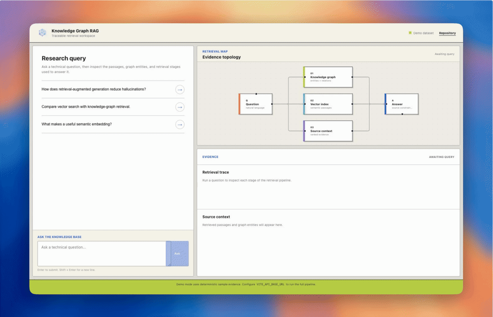
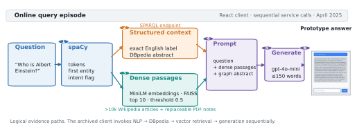

# Knowledge Graph RAG Assistant

This capstone started from a simple frustration: a RAG answer can sound confident while hiding what it retrieved. Here, the dense-search and DBpedia paths stay on screen, and each evidence node can be opened.

[](https://github.com/ethanvillalovoz/knowledge-graph-rag-assistant/actions/workflows/test.yml)
[](LICENSE)

[Project page](https://knowledge-graph-rag.github.io/) · [Technical report](docs/paper/knowledge-graph-rag-technical-report.pdf) · [Video](https://www.youtube.com/watch?v=YWdR3FAdq1o) · [Data](https://huggingface.co/datasets/ethanvillalovoz/knowledge-graph-rag-retrieval-artifacts/tree/28777c9a144261672040710e0316ca5e40345172)

[](docs/media/rag-demo.mp4)

For the recording, a deterministic fixture supplies the retrieval trace so the source-selection interaction is reproducible. The clip demonstrates the interface; it does not score retrieval quality. [MP4 demo](docs/media/rag-demo.mp4) · [poster frame](docs/media/rag-poster.webp)

## Why This Exists

Most chat interfaces collapse retrieval into a spinner. This one exposes entity extraction, graph lookup, semantic retrieval, and the evidence that survives into the answer prompt.

The repository is Ethan Villalovoz's maintained fork of a Washington State University senior design capstone built for [HackerEarth](https://www.hackerearth.com/). The original team was Molly Iverson, Ethan Villalovoz, Chandler Juego, and Adam Shtrikman.

## System

[](docs/media/system-overview-paper.svg)

The figure records the archived April 2025 query path. An [editable retrieval-flow diagram](docs/media/retrieval-flow.excalidraw) is also included for maintainers.

| Layer | Responsibility |
| --- | --- |
| React + TypeScript | Conversation, source context, and retrieval trace |
| FastAPI | Validated API boundary and orchestration |
| SentenceTransformers + FAISS | Dense semantic retrieval over Wikipedia passages |
| DBpedia | Explicit entity and relationship context through SPARQL |
| OpenAI | Concise synthesis over retrieved evidence |

## Run The Interface

The frontend includes a deterministic demo dataset, so the product can be evaluated without credentials or multi-gigabyte retrieval artifacts.

```bash
cd frontend/rag-app
npm ci
npm run dev
```

Open [http://localhost:3000](http://localhost:3000). Demo mode is labeled in the interface and never pretends to be a live model response.

## Run The Full Pipeline

1. Copy the environment template and set an OpenAI API key.

   ```bash
   cp .env.example .env
   ```

2. Download and checksum the versioned Wikipedia corpus files.

   ```bash
   python3 scripts/download_corpus.py
   ```

3. When running the backend directly, download and checksum the two retrieval artifacts from the pinned [project-owned dataset revision](https://huggingface.co/datasets/ethanvillalovoz/knowledge-graph-rag-retrieval-artifacts/tree/28777c9a144261672040710e0316ca5e40345172):

   ```bash
   python3 scripts/download_retrieval_artifacts.py
   ```

   - `text_embeddings.npy` → `backend/app/data_processing/embeddings_data/`
   - `index.faiss` → `backend/app/data_processing/vector_search_data/`

   Docker Compose users can skip this command: the backend image downloads this same revision and verifies both SHA-256 checksums during the build.

4. Start both services.

   ```bash
   docker compose up --build
   ```

The frontend runs at [http://localhost:3000](http://localhost:3000), the API at [http://localhost:8000](http://localhost:8000), and interactive API documentation at [http://localhost:8000/docs](http://localhost:8000/docs).

For direct backend development:

```bash
python3.10 -m venv .venv
source .venv/bin/activate
pip install -r backend/requirements-dev.txt
uvicorn backend.app.main:app --reload
```

## Repository Map

```text
backend/app/handlers       LLM, embedding, and vector-search services
backend/app/routers        FastAPI route boundaries
backend/app/data_processing
                           dataset preparation utilities and local artifacts
frontend/rag-app/src       typed product interface and deterministic demo
tests                      backend unit and integration coverage
docs                       paper, reports, code guides, and project history
```

## Verification

```bash
CI=true PYTHONPATH=. pytest -q tests/
cd frontend/rag-app && npm run check
```

CI runs both suites on every pull request. Service initialization is lazy, so unit tests do not download an embedding or generation model unless a test explicitly exercises it.

## Design Decisions

- **Inspectable by default:** sources and retrieval stages stay adjacent to the answer.
- **Honest offline mode:** contributors can review the product without an API key; live and fixture data are visibly distinct.
- **Constrained boundaries:** query lengths, source counts, CORS origins, and public error messages are validated at the API edge.
- **Large artifacts out of Git:** corpus parquet files are checksum-verified release assets; the FAISS index and embedding matrix remain in the project dataset.

## Limitations

- Retrieval quality depends on corpus coverage, chunking, and similarity thresholds.
- DBpedia can return sparse results for ambiguous or uncommon entities.
- Exposing evidence improves inspectability but does not guarantee factual correctness.
- The included demo is a product fixture, not an evaluation of the full retrieval pipeline.

## Project Record

- [Project page](https://knowledge-graph-rag.github.io/)
- [Technical report](docs/paper/knowledge-graph-rag-technical-report.pdf)
- [Citation metadata](CITATION.cff)
- [Demo video](https://www.youtube.com/watch?v=YWdR3FAdq1o)
- [Final report](docs/project-report/RAGApp-FinalReport.pdf)
- [Project abstract](docs/project-report/Project-Abstract.pdf)
- [Performance notes](docs/performance-stats.md)
- [Sprint reports](docs/sprint-reports/)

The technical report describes the capstone system preserved at commit [`1ad5cc0`](https://github.com/ethanvillalovoz/knowledge-graph-rag-assistant/tree/1ad5cc08cbebdeae655cad626393364b2f476556). The current `main` branch is a maintained public fork and may contain later documentation, interface, dependency, and safety improvements. See [Reproducibility](docs/REPRODUCIBILITY.md) before comparing the report with the current runtime.

## License

Source code is licensed under the terms in [LICENSE](LICENSE). Original team attribution is preserved above and in the project reports. Data and media have separate provenance or reuse conditions described in [DATA_NOTICE.md](DATA_NOTICE.md) and [ASSET_SOURCES.md](ASSET_SOURCES.md).
